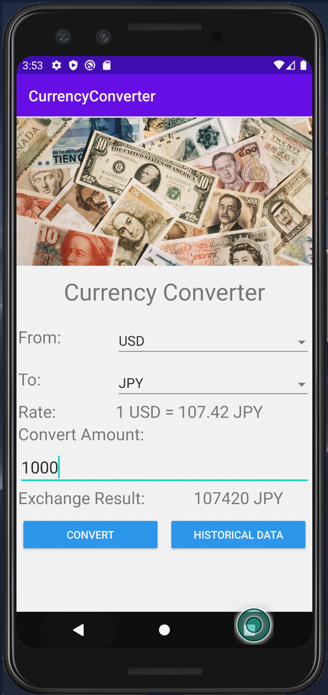
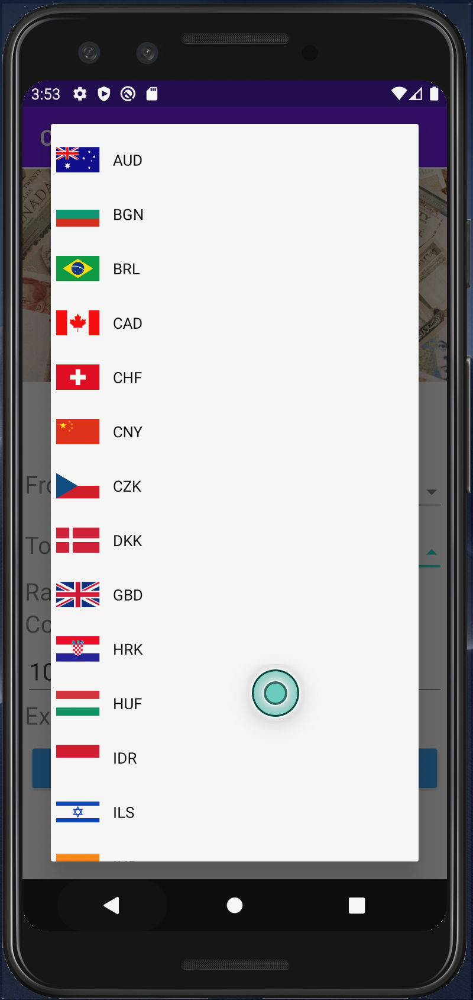

## Currency Converter App

This app was created while learning Android course on <a href="https://www.udemy.com/course/the-complete-android-oreo-developer-course/learn/lecture/8339346#overview">Udemy</a>

# Main functions:  
1. Convert from a currency to another currency
2. Fetch historical currency rate 

# Currency Rate Data:  
 I using <a href="https://exchangeratesapi.io/">exchangerates</a> API

# Used Library: 
1. <a href="https://github.com/google/volley">Volley</a> : HTTP library that makes networking for Android apps easier and faster
2. <a href="https://github.com/fabriciorod/material-buttons">Material Button</a> : Styles for the Android Button.
3. <a href="https://github.com/PhilJay/MPAndroidChart">MPAndroidChart</a> : A powerful & easy to use chart library for Android 
4. <a href="https://github.com/tiper/MaterialSpinner">MaterialSpinner</a> : MaterialSpinner aims to provide a Material Design Spinner.

# Some Captures:

1. Convert Activity:

2. Historical Activity:

3. Spinner Custom:

